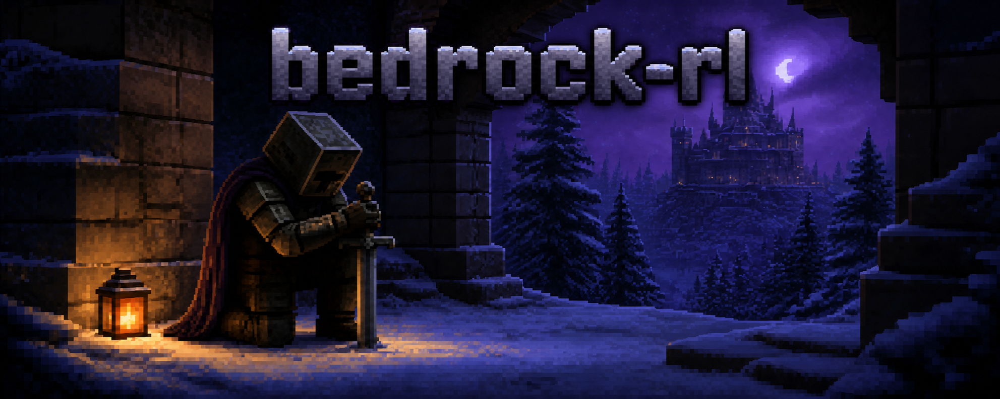
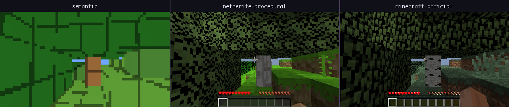
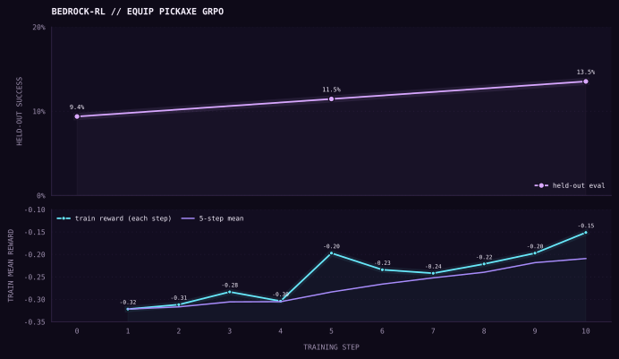

# bedrock-rl

Build and train AI agents in Minecraft.



Powered by [Netherite](https://github.com/Infatoshi/netherite) for deterministic
C/CUDA Minecraft simulation and [verl](https://github.com/volcengine/verl) for
distributed reinforcement learning.

Define a world and its reward once, generate reproducible train/dev/test
episodes, then use your own harness or a shipped SFT, SDFT, SDPO, OPD/MOPD,
or verl-backed RL trainer.

The Minecraft environment is the product. Tools, context policy, hints, state
capture, reward, model, and trainer are replaceable components.

Choose the pixels per task. The strip below compares the semantic view,
deterministic redistributable textures, and official textures extracted
locally from a Minecraft client jar you own:



## Quick start

```bash
git clone https://github.com/michaelbf16/bedrock-rl bedrock-rl
cd bedrock-rl
uv sync --extra netherite --extra data
uv run bedrock setup --runtime-only
uv run bedrock doctor --runtime-only
```

Validate an included training recipe without generating data or using a GPU:

```bash
uv run bedrock generate examples/equip_pickaxe_grpo/data.yaml --check
uv run bedrock train examples/equip_pickaxe_grpo/train.yaml --dry-run
```

## Modular synthetic data generation

An SDG job is assembled from independent YAML-selected components:

```text
task + sampler + qualifier + policy + executor + writer
```

The task defines the world, instruction, budgets, failures, and live success
check. The sampler varies world and policy seeds independently. An optional
snapshot qualifier rejects impossible terrain before play. A policy plans
from each natural world and emits ordinary mouse/keyboard actions. The
executor runs isolated C-engine episodes in parallel, and the writer persists
only trajectories that passed the unchanged task verifier. Every component is
an import path, so a project can replace one without forking the pipeline.

[`farm_one_log_sdg`](examples/farm_one_log_sdg) is the minimal complete
example: find a natural tree, break one trunk block, collect the drop, and
verify that one new log entered inventory. The same saved action stream below
was replayed in the semantic, Netherite procedural, and Minecraft official
renderers; all three reproduced the same 454 engine ticks and successful
terminal state.


The task itself is declarative:

```yaml
name: farm_one_log_sdg
goal: Find a nearby tree, harvest one natural log, and collect it.
initial_state:
  spawn:
    constraints:
      - {block: log, min_distance: 4, max_distance: 12}
success: {type: item_gained, item: log, count: 1, reward: 1.0}
```

The separate [generation manifest](examples/farm_one_log_sdg/data.yaml)—named
`data.yaml` in this example—chooses `RandomCases`, `PlannedMinePolicy`,
`ProcessExecutor`, and `TrajectorySFTWriter`. Change `worlds` to request any exact
accepted count; unsuitable seeds are logged and replaced automatically, while
`workers: auto` scales across the available CPUs.

```bash
uv run bedrock generate examples/farm_one_log_sdg/data.yaml --check
uv run bedrock generate examples/farm_one_log_sdg/data.yaml \
  --set worlds=25
```

The example also includes a windowed SFT warm-start and RL continuation;
its README has the runnable commands. The same machinery supports longer progression policies, custom objectives,
headless seed qualification followed by exact pixel replay, local process
pools, or Modal CPU fleets. Accepted parquet and the rejection ledger are
published atomically, and every row retains enough provenance to reproduce
its world, decision, plan, and controls.

## Example training run

[`equip_pickaxe_grpo`](examples/equip_pickaxe_grpo) randomizes all nine hotbar
items and asks Qwen3-VL 2B to select the iron pickaxe. Reward comes from the
live selected item, not the generated text. Its manifests define balanced,
seed-disjoint train and development data, a sealed test-data job, and a GRPO
run from the unmodified base model. The example README includes the complete
generate, train, checkpoint-selection, and paired-evaluation workflow.

In the shipped 10-step smoke run, fixed development success was 27/288 at
base, 33/288 at step 5, and 39/288 at step 10. The raw records and
seed-clustered intervals are committed with the example. The observed
step-10 gain is not statistically conclusive, so it is presented as a
pipeline check rather than a benchmark claim.

With three stochastic attempts per prompt, pass@3 is 31/288 for the base and
64/288 for step 10 (37 paired improvements, 4 regressions; exact
`p=1.03e-7`). This measures candidate-generation coverage, while the curve
below remains the stricter single deterministic attempt.



The curve shows mean on-policy reward at every training step and deterministic
development success at each evaluated checkpoint.

This is one demonstration of the framework, not a built-in task assumption.
Reuse its separation of task, generation, and training concerns for
navigation, crafting, mining, combat, GUI, or custom Minecraft objectives,
and replace any component that the task needs.

## Documentation

The examples conventionally use `task.yaml` for Minecraft behavior,
`data.yaml` for generation, and `train.yaml` for the learner. Those are
ordinary filenames, not schemas or registry entries: the task, generation,
and training commands accept user-chosen YAML paths, and framework-owned
relative paths inside one manifest resolve beside that manifest. Bare names
such as `equip_pickaxe_grpo` optionally resolve to `task.yaml` in the matching
example directory; custom task files can use any explicit local path and any
`.yaml` or `.yml` name. Modal launches
require their manifest and referenced project files to live inside the
checkout so they can be included in the remote image. Use only the manifests
your work needs.

| Goal | Guide |
| --- | --- |
| Understand package boundaries and extension points | [Architecture](docs/architecture.md) |
| Make a Minecraft task and reward | [Tasks](docs/tasks.md) |
| Generate prompts or demonstrations and write a policy | [Synthetic data](docs/synthetic-data.md) |
| Launch locally, multi-node, or on Modal | [Training](docs/training.md) |
| Use or add a VLM family | [Models](docs/models.md) |
| Add tools, context management, guidance, or a harness | [Custom agents](docs/custom-agents.md) |
| Compare the implemented learning methods | [Training methods](docs/trainers.md) |

Start at the [documentation index](docs/README.md) for the complete short
path. Components such as tools, context policies, hints, probes, rewards,
generators, and harnesses are replaceable by `package.module:object` import
paths.

## Install only what you need

```bash
uv sync                         # task framework and CLI
uv sync --extra netherite      # Minecraft environment and rendering
uv sync --extra data           # dataset generation
uv sync --extra train          # local Hugging Face trainers and LoRA
uv sync --extra plot           # Matplotlib result charts
uv run bedrock setup --runtime-only  # patched Minecraft runtime only
uv run bedrock setup                 # add pinned verl/vLLM GPU stack
```

`bedrock setup`, Docker, and Modal apply the pinned engine patches
automatically. Clone users never apply diffs by hand.

The CPU Docker target covers task/data generation and remote-API
`bedrock trial` runs. The GPU target adds local vLLM evaluation and verl
training:

```bash
NETHERITE_SHA="$(cat patches/netherite/PINNED_SHA)"
docker build --target cpu --build-arg NETHERITE_SHA="$NETHERITE_SHA" \
  -t bedrock-rl:cpu .
docker run --rm bedrock-rl:cpu
```

The published image uses deterministic procedural textures. To build a local
comparison image with Minecraft textures, use the owned-jar asset target; do
not publish that Docker image:

```bash
docker build --target cpu --build-arg NETHERITE_SHA="$NETHERITE_SHA" \
  --build-arg ASSETS=jar -t bedrock-rl:minecraft-official .
```

For a local resource pack, build a dedicated engine checkout:

```bash
uv run bedrock setup --runtime-only \
  --netherite-home /opt/netherite-faithful \
  --mc-jar /path/to/1.11.2.jar --texture-pack /path/to/faithful.zip
export NETHERITE_HOME_JAR=/opt/netherite-faithful
```

Launch the same training manifest on Modal without adding a cloud config:

```bash
uv sync --extra modal
uv run bedrock train examples/equip_pickaxe_grpo/train.yaml \
  --modal --gpu H100
# The experimental multi-node path requests two full 8-GPU H100 hosts here.
uv run bedrock train examples/equip_pickaxe_grpo/train.yaml \
  --modal --nodes 2 --gpu H100 --secret huggingface
```

For a resumable long run, add a stable ID such as
`--modal-run equip-pickaxe-01` and reuse it on relaunch. Completed checkpoints
and metrics are committed to the same durable run directory even when the
trainer exits with an error.

Modal multi-node support is experimental until `--modal-smoke` passes in your
workspace. The adapter normalizes `CUDA_VISIBLE_DEVICES`, brings up Ray on
every node, and uses CUDA, cross-node NCCL, and Ray probes before training.
Successful runs persist checkpoints, metrics, and trajectories in the
`bedrock-rl-runs` Modal Volume by default. Add `--rdma` only in a Modal
workspace with RDMA enabled; the portable default needs no workspace feature.

## License

This project is MIT licensed. Patched upstream dependencies retain their own
terms; see [`THIRD_PARTY_LICENSES`](THIRD_PARTY_LICENSES). Minecraft is a
trademark of Mojang. bedrock-rl ships no client jar or extracted texture
atlas; the example gameplay capture was rendered in-game.
